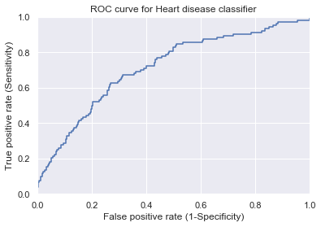

# 
 Predict whether patients have risk of future Coronary Heart disease
 <pre>
Contrubuter  : Sandeep Bansal
</pre>

<pre>
Languages: Python
Tools/IDE: Anaconda
Libraries: pandas, matplotlib, numpy, sklearn, seaborn
</pre>

<pre>
Assignment Submitted: December 2020
</pre></b>
---
## Buisness Objective </b> 
- Using Logistic Regression can we pinpoint the most relevant/risk factors of heart disease as well as predict the overall risk?
## Project Overview
- <b>Data</b> The dataset is publically available on the Kaggle website, and it is from an ongoing ongoing cardiovascular study on residents of the town of Framingham, Massachusetts. The classification goal is to predict whether the patient has 10-year risk of future coronary heart disease (CHD).The dataset provides the patients’ information. It includes over 4,000 records and 15 attributes  
  - The raw dataset can be found on the Kaggle website, [here](https://www.kaggle.com/amanajmera1/framingham-heart-study-dataset). 
- <b>Research</b> 
  -World Health Organization has estimated 12 million deaths occur worldwide, every year due to Heart diseases. Half the deaths in the United States and other developed countries are due to cardio vascular diseases. The early prognosis of cardiovascular diseases can aid in making decisions on lifestyle changes in high risk patients and in turn reduce the complications. This research intends to pinpoint the most relevant/risk factors of heart disease as well as predict the overall risk using logistic regression.The remaining research can be found 
  [here](https://www.who.int/news-room/fact-sheets/detail/cardiovascular-diseases-(cvds))
  - If you are unfamiliar with heart health and its disease process please check out **Heart Disease Pathophysiology video which can be found** [here](https://www.youtube.com/watch?v=lTCF8y7e1Bw)
---
## Abstract and Introduction:
- CVDs are the number 1 cause of death globally: more people die annually from CVDs than from any other cause.
- An estimated 17.9 million people died from CVDs in 2016, representing 31% of all global deaths. 
- Of these deaths, 85% are due to heart attack and stroke.
- Over three quarters of CVD deaths take place in low- and middle-income countries.
- Out of the 17 million premature deaths (under the age of 70) due to noncommunicable diseases in 2015, 82% are in low- and middle-income countries, and 37% are caused by CVDs.
#  
 
  
---
## Motivation: 
- Cardiovascular diseases (CVDs) are the number 1 cause of death globally, taking an estimated 17.9 million lives each year. CVDs are a group of disorders of the heart and blood vessels and include coronary heart disease, cerebrovascular disease, rheumatic heart disease and other conditions.

---

## Proposed Methodology of Modeling:
- Logistic regression is one such regression algorithm which can be used for performing classification problems. It calculates the probability that a given value belongs to a specific class. If the probability is more than 50%, it assigns the value in that particular class else if the probability is less than 50%, the value is assigned to the other class. Therefore, we can say that logistic regression acts as a binary classifier.
- For this project we will calculate the probability that a patient has diabetes which will be labeled the dependent variable. 0 = Not risk for CHD, 1 = Patient Risk for CHD
---
## Results and Primary Findings:
 ---
| Model | Evaluation |
| --- | --- |
| **Accuracy** | 0.85 |
| **Precision** | 0.53 |
| **F1_Score** | 0.13 |
| **Recall** | 0.76 |
- Accuracy: Help us determine or predict the true diabetic person out of the population. It is the fraction of predicted diabetic patients that the model got right.
- Precision: ssists to determine what are the relevant positive diabetic patients out of entire positive diabetic predictions.If what you have predicted and actual are matching. ) 
- F1_Score: Harmonic mean of precision and recall. We consider F1_score because it balances between precision and recall.
- Recall: Fraction of actual diabetic patients to the number of diabetic patients retrieved from population.

#  
 
  - Measure of model and how it can distinguish two seperate groups under the target variable. The more area under the curve the better the model.
---
## Limitations and Future work:
  - 
---
## Conclusion and summary:
  - 
 
---
## References and contributions:

1. 
2. 
3. 
4. 
5. Professor Murat Guner: https://github.com/mguner/UMBC_DATA602/tree/master/Week-4
6. 
